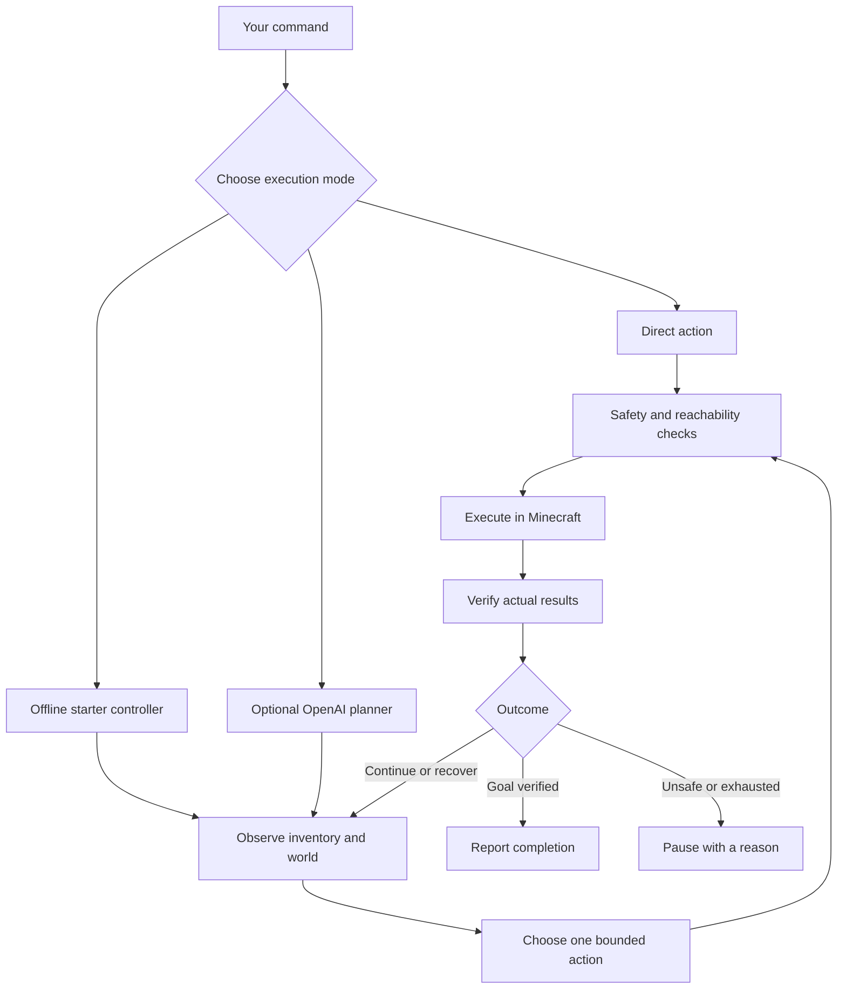

> **BroBot Core 0.2:** 346 automated checks and **11/20** known natural worlds, versus Core 0.1’s 10/20. One additional completion; nine worlds still failed. Separate original-world regression: **1/3**, down from Core 0.1’s 2/3. [Full records and limitations](benchmarks/results/core02-2026-10-04/README.md).

# BroBot

### A Minecraft companion that turns commands into real actions

Explore together. Gather materials. Craft a starter kit. See exactly what happened when a plan works—or why it stopped.

**Local first · Java 1.21.8 · Direct controls without an API key · Optional OpenAI planning**

[Get started](#get-started) · [Commands](#your-first-five-minutes) · [How it works](#how-it-works) · [Benchmarks](#measured-not-guessed) · [Alpha roadmap](#the-road-to-alpha-1)

> **Development preview:** BroBot can execute useful Minecraft actions today. Autonomous starter mode remains experimental: the current source completed 11 of 20 known worlds. Every failed run is retained. Reliable survival across arbitrary terrain and beating the game remain unproved.

## New in Core 0.2

- Checks for a way out before automatically placing a crafting table
- Finds resources across diagonal chunk boundaries without expanding the requested collection radius
- Remembers exhausted scouting directions and tries bounded alternatives
- Skips redundant collection retries only when fresh terrain, inventory and position checks still match
- Switches promptly to eating or returning home when the observed state calls for it

Core names identify the software agent release, not a newly trained foundation model. These changes are covered by 346 automated checks. Natural-world success remains limited: 11/20 on the same known development seeds, with no failed run replaced. The automatic canopy-recovery experiment did not demonstrate improvement and is excluded.

## Meet your second pair of hands

BroBot joins a local Minecraft Java world as a companion. Give it direct commands, start its bounded offline starter job, or connect an OpenAI API account for natural-language goals. Actions use observed terrain and actual inventory, with explicit results and limits.

| You want to… | BroBot can… |
| :--- | :--- |
| Explore together | Follow a visible player, approach you, navigate to coordinates and return to saved waypoints |
| Get materials | Find observed blocks, mine reachable targets and report which drops actually reached inventory |
| Make useful items | Craft, equip tools, use furnaces and work with real inventory |
| Build something small | Place blocks and construct simple floors, walls and hollow boxes where support and materials allow |
| Try autonomous gathering | Attempt a wood → stone pickaxe → furnace → return-home starter job without an API key |
| Stay in control | Stop work, inspect progress and explicitly resume paused starter jobs |

Other implemented tools cover eating, sleeping, item transfer, block interaction and bounded combat. Portal and End progression tools are experimental: their presence is not a demonstrated full-game strategy.

## Get started

**You need:** Node.js **22.9+**, a licensed Minecraft client, and the repository downloaded to your computer. Setup downloads Java 21 if a compatible installation is missing. Initial downloads require internet access.

### Download and launch

Unzip the [development download](https://brobot-showcase.vercel.app/download), then:

- **Windows:** double-click `Start-BroBot.cmd`
- **macOS / Linux:** open a terminal in the extracted folder and run `sh start-brobot.sh`

Install Node.js 22.9+ first. The launcher installs the locked dependencies,
opens setup if needed, and starts the local world. It asks you to review the
Minecraft EULA rather than accepting it silently. Keep the terminal open while
playing; Ctrl+C saves and closes the world.

### Prefer Git?

```sh
git clone https://github.com/flowzygames/BroBot.git
cd BroBot
git checkout feat/starter-recovery-and-readme
npm ci
npm run setup
npm run play
```

This README describes the development branch `feat/starter-recovery-and-readme`. Until its draft pull request is merged, a default-branch checkout may not contain these features.

1. Enter your exact player name during setup. Leave the API key blank to use direct controls and the offline starter.
2. Review and accept the [Minecraft EULA](https://www.minecraft.net/en-us/eula) when the launcher asks.
3. Open the dashboard at **http://127.0.0.1:3000**.
4. Join the local world and set the owner name to the connected player name shown in the dashboard.

| Client | Join address |
| :--- | :--- |
| Minecraft Java **1.21.8** | `127.0.0.1:25565` |
| Minecraft for Windows / supported Bedrock client | `127.0.0.1`, port `19132`, through Geyser |

**Local by default.** The server's Java and Bedrock listeners bind to your computer only. No router port forwarding is needed. Another device cannot use these loopback addresses to join. Server authentication is disabled for this local setup; do not expose it publicly. You still need a licensed Minecraft client.

For Windows loopback issues, client-version mismatches or setup questions, see the [full play guide](docs/USAGE.md#if-bedrock-cannot-connect). Run `npm run doctor` for connection diagnostics.

## Your first five minutes

Use commands in the dashboard or launcher terminal. In Minecraft chat, prefix owner commands with `!bro`, for example `!bro follow me`.

```text
status
inventory
follow me
remember home
home
stop
```

A small set of ordinary phrases also works **offline**, without an API key:

```text
collect 4 oak logs
mine two iron ore
craft a furnace
make me a stone pickaxe
```

These are exact supported command patterns, not general language understanding.
Use a specific wood species and a count from 1 to 64. BroBot still checks tools,
materials and reachable terrain. Compound requests and explicit `goal`/`ask`
commands use the optional paid planner.

For the experimental offline starter:

```text
survive starter
```

BroBot observes its surroundings, gathers wood, makes tools, attempts a stone pickaxe and furnace, then returns alive to the starting point. It reuses verified crafting tables and can clear a limited amount of visible obstruction around tracked drops. It may still stop when terrain, hunger, health or planning limits prevent progress.

`survive resume` explicitly resumes a saved paused or blocked job. Check the world and inventory first. Death, disconnects and process restarts do not silently restart the job.

For an individual action:

```text
action inspect {"radius":16}
action collect {"block":"oak_log","count":4,"radius":24}
action craft {"item":"oak_planks","count":8}
```

Craft counts mean desired output items. Collect counts mean blocks mined; pickups are reported separately. Four broken blocks do not automatically mean four items in your inventory.

**Leaving the game?** Close BroBot from the dashboard, type `quit`, or press Ctrl+C in the launcher. With `npm run play`, this saves and stops the world too. `stop` cancels work; it does not pause Minecraft, so an idle bot remains vulnerable.

## Three ways to use BroBot

| Mode | Needs an API key | What it does |
| :--- | :---: | :--- |
| Direct commands | No | Runs explicit supported controls or individual actions |
| Offline starter | No | Chooses the next step for one bounded starter-kit objective from live observations |
| OpenAI planner | Yes | Uses a model to select bounded tools for written goals |

The offline starter is a deterministic controller, not a local language model. Fully offline natural-language planning would require a separate local-model integration.

To try the optional planner, enter your key through the local setup prompt and configure `OPENAI_MODEL` for a model your API account can access. Then give a goal such as:

```text
goal Gather nearby oak logs and craft a crafting table and wooden pickaxe.
```

OpenAI API calls are paid separately from ChatGPT subscriptions. No live API planner evaluation was run in the current validation work. The default request/token limits persist across restarts, but are not a dollar-spending guarantee. Keep `.env` and API keys out of GitHub.

## How it works



The runtime separates decisions from game actions. It verifies pickups, crafting outputs and supported completion conditions rather than trusting a plan's wording. Unsupported or compound goal completion may remain explicitly unverified.

Starter jobs have health, hunger, dimension, travel and work limits: up to 24 scouting attempts, 96 work steps and ten minutes by default. BroBench uses five minutes. Stops and safeguards reduce risk; they do not guarantee success.

[Architecture and tools](docs/ARCHITECTURE.md) · [Navigation safeguards](docs/NAVIGATION_SAFEGUARDS.md)

## Measured, not guessed

### Current wood and safety checkpoint · October 2, 2026 UTC

- **293 automated checks**, **17/17 prepared smoke phases**, **11/11 skills**, and **20/20 local controls** passed
- Reduced redundant wood collection after partial crafting; immediate powder-snow contact warning
- **1/2 selected known-world replays** completed; no full 20-world score on this source
- The passing replay changed route before gathering and did not exercise the changed partial-wood branch, so it is not causal proof of improvement

[Current evidence and tested-code manifest](benchmarks/results/wood-deficit-2026-10-02/)

### Previous expanded exploration checkpoint · October 2, 2026 UTC

- **256-block search region**, up to **24 scouts** and **96 work steps**
- Long returns use observed waypoint chains with forward-and-reverse route checks
- **287 automated checks**, **17/17 prepared smoke phases**, **11/11 skills**, **20/20 local controls** passed
- Selected world 1041160109 completed in 290.165s, reaching 193.26 blocks from home before returning with the kit and full health
- The later full evaluation completed **9/20**, including one explicitly disclosed infrastructure recovery; all original failures remain retained
- The separate previous 90-block scouting candidate completed **12/20**, versus the older release's10/20; that is a different source

[Earlier selected evidence](benchmarks/results/expanded-exploration-2026-10-02/) · [Completed 287 cohort](benchmarks/results/expanded-cohort-2026-10-02/) · [Previous scouting cohort](benchmarks/results/scout-routes-2026-10-02/)

### Previous standing-cell recovery checkpoint · October 1, 2026

- **254 automated checks**, **17/17 prepared live phases**, **11/11 prepared skill cases**, and **20/20 local controls** pass on frozen app `a3e2242`
- **10/20 known worlds completed**, matching the previous published `682bf46` build on every seed; ten failures remain
- The intermediate `6b26ad5` experiment scored **8/20** and is retained, including its two losses
- A separate targeted replay completed in **107.416 seconds**, with observed inventory gains, a stone pickaxe and furnace, and a living return to the start
- A bounded pickup probe can now certify one visible removal that creates safe standing space near a tracked drop, while checking both walking directions
- `action descend_notch {}` is a separately invoked experimental one-leaf descent; it does not automatically descend a whole canopy

[Complete current evidence and tested-file manifest](benchmarks/results/pocket-standing-2026-10-01/) · [Recovery mechanism and limits](docs/FOLIAGE_RECOVERY.md)

These are known-case single-run outcomes. Variable mob and item timing means the paired successes do not isolate the fix's effect. One server startup stopped before world creation and was restarted unchanged; no completed gameplay result was replaced. Stable 1.0, rendered Windows/Mac or actual Bedrock-client gameplay, and paid-planner behavior remain unverified.

### Previous transit recovery checkpoint · October 1, 2026

- **219 automated checks**, **17/17 prepared live phases**, **11/11 prepared skill cases** and **20/20 local controls** pass on clean app `682bf46`
- All three original known worlds completed the full starter objective, in 159.168s, 94.701s and 91.327s
- A previously failing world completed a targeted replay in 242.380s, using the new bounded transit-obstruction recovery
- A separately prepared live diagnostic recovered ten pre-existing cobblestone after clearing one safe dirt obstruction, then returned with them alive; this is not a fresh-world score
- **10/20 wider known worlds completed**, compared with the previous first-pass result of 8/20; all eight previous successes completed again and two prior failures now completed

[Current records and exact tested-file manifest](benchmarks/results/transit-2026-10-01/) · [How safe transit clearance works](docs/PICKUP_TRANSIT.md)

This previous checkpoint remains preserved for comparison. Individual runs can vary with mob/item timing, and these worlds informed development. Stable 1.0, rendered Windows/Mac client gameplay and paid-planner behavior remain unverified.

### Earlier measured recovery checkpoint

- **208 automated checks pass**, plus source syntax checks
- **17/17 real-server regression phases pass**, including three repetitions of a previously troublesome grass-corner route
- **11/11 prepared skill cases** and **20/20 local grammar/control cases** pass
- **3/3 original development worlds** completed the full starter objective on one clean app revision: 100.478s, 158.151s and 76.891s
- **2/3 additional development worlds** completed it: 86.129s and 99.866s. The canopy case reached the 300-second limit
- Windows/Ubuntu Node 22/24 checks run on [PR 7](https://github.com/flowzygames/BroBot/pull/7). Actual rendered Windows/Mac gameplay and live paid-planner behavior remain unverified here

**2/4 wider known worlds** completed the objective. These are reruns of the earlier first-pass sample; the treeless and mangrove cases still failed. The separate preselected twenty-world first-pass evaluation completed **8/20 (40%)**, with every failure retained. [All twenty records and the selection plan](benchmarks/results/wide-first-pass-2026-10-01/).

The tested app snapshot is `1e7ab1f`. All ten are known development cases, not a general reliability percentage. The earlier 526 source failed world 42; that result remains visible alongside this later complete rerun. Every scheduled result, including all failures, is [published with its conditions](benchmarks/results/pickup-preflight-2026-10-01/). The original frozen comparison below remains unchanged.

#### What improved

- More reliable corner movement through a narrowly scoped floating-point collision correction
- Reverse-first pickup planning that rejects sealed target pockets while still requiring a verified round trip
- Same-session pickup recovery after explicit resume, with stale IDs discarded after respawn/reconnect
- Specific safety pause reasons retained, and offline torch plurals / capitalized owner pronouns handled correctly
- Fairer dropped-item recovery, bounded planning, and no more stale recovery trips after the tracked items are gone
- Starter-only avoidance of water, aquatic plants and waterlogged standing cells, plus player-specific air checks
- Better tree/table observation, batched starter materials, and safer support/liquid checks
- Friendly platform launchers, direct offline gathering/crafting phrases, and clearer dashboard progress

The build is still a **development preview**, not a completed stable 1.0. See the [evidence and remaining limits](benchmarks/RESULTS.md).

### Frozen BroBench comparison

These results compare the earlier PR 4 source with the original offline-starter candidate **before the latest recovery fixes**. They remain unchanged; the later success is reported separately.

| Benchmark | What it measures | Earlier candidate | Starter candidate |
| :--- | :--- | ---: | ---: |
| **MineLine** | Mining and actual pickup in prepared scenarios | 3/3 | 3/3 |
| **Workbench** | Crafting with supplied ingredients | 6/6 | 6/6 |
| **Pathfinder** | Prepared detour and climb/return routes | 2/2 | 2/2 |
| **CommandSense** | Supported local command grammar | 12/14 | 14/14 |
| **SafetyLatch** | Simulated control and failure checks | 6/6 | 6/6 |
| **Trailhead** | Fresh-world starter kit and return | 0/3, mode absent | 0/3 |
| **GoalSense LLM** | Live model language and planning | Not run | Not run |

Trailhead used three fixed development seeds, normal survival, empty inventory, fixed spawn settings and a five-minute limit. It supplied no items and changed no terrain. Prepared skill tests are different: they supply ingredients and fixtures. CommandSense is not a general language-understanding score, and the earlier candidate's absent starter mode says nothing about its separate paid planner.

There is no invented overall intelligence score. Failed and unsupported cases remain visible. [Protocol and reproduction](benchmarks/README.md) · [Results and limitations](benchmarks/RESULTS.md) · [Historical validation](docs/VALIDATION.md) · [Manual player check](docs/PLAYTEST.md)

## The road to Alpha 1

Alpha 1 should mean a useful, dependable starter companion with clear failures—not a promise to do everything in Minecraft.

- [x] Direct controls and bounded action execution
- [x] Experimental observation-driven starter controller
- [x] Reproducible named benchmarks with retained failures
- [x] Measured starter completion and return across several development worlds
- [ ] Resolve remaining canopy and resource-scarce terrain limits
- [ ] Validate interruption, reconnect and recovery in broader live scenarios
- [ ] Test the actual Windows/Bedrock client experience
- [ ] Review and merge the draft changes into a clear release
- [ ] Evaluate optional language planning with a separately approved API budget
- [ ] Expand toward food, shelter and longer progression after starter reliability improves

Alpha 1 has not been declared ready. The starter job does not cover food production, shelter, night survival, iron progression or beating the game.

## For builders

```sh
npm run check       # Source syntax and automated tests
npm run test:live   # Isolated real-server regression world
npm run doctor     # Local setup and connection checks
```

Benchmark commands and version-comparison instructions are in [BroBench](benchmarks/README.md). Live tests use isolated worlds, not your normal play save. Follow the normal server setup and EULA flow before running them.

| Area | Source |
| :--- | :--- |
| Runtime and orchestration | `src/runtime.js` |
| Game actions and movement checks | `src/actions.js` |
| Offline starter decisions | `src/survival.js` |
| Tracked-drop clearance observations | `src/survival-observation.js` |
| Local command parsing | `src/commands.js` |
| Regression tests | `test/` |
| Benchmark harnesses and protocol | `scripts/benchmark-*.js`, `benchmarks/` |

Built with JavaScript, Node.js, Mineflayer, mineflayer-pathfinder and the OpenAI SDK. The local Minecraft world uses Paper with Geyser and bridge components.

**Troubleshooting:** [Full play guide](docs/USAGE.md) · [Validation limits](docs/VALIDATION.md) · [Open an issue](https://github.com/flowzygames/BroBot/issues)

Expanded starter exploration uses a 256-block job radius (262-block emergency stop), up to 24 scouts with legs no longer than 64 blocks, and observed intermediate waypoints for longer home/table returns. Each return leg must have a verified forward-and-return walking route; unknown or blocked routes stop the job. The ten-minute job deadline remains. A larger allowed region is not a promise of complete coverage or safe arrival. The separate one-leaf canopy descent keeps its narrower proof limits.
