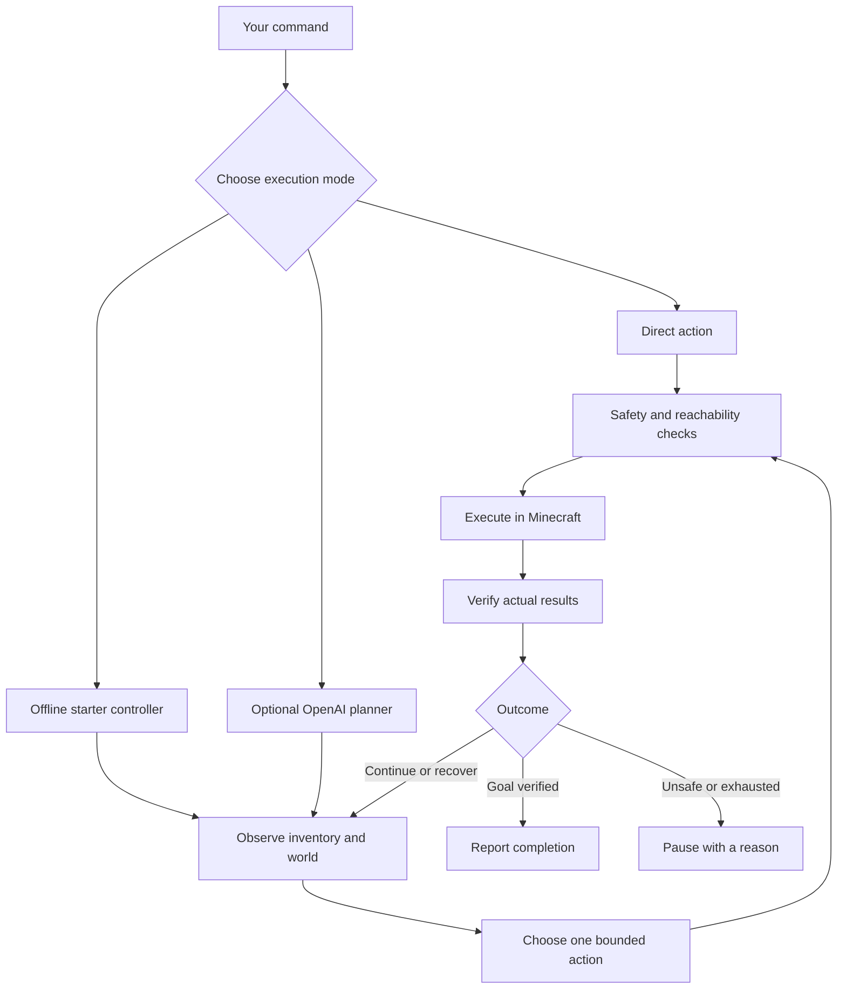

# BroBot

### A Minecraft companion that turns commands into real actions

Explore together. Gather materials. Craft a starter kit. See exactly what happened when a plan works—or why it stopped.

**Local first · Java 1.21.8 · Direct controls without an API key · Optional OpenAI planning**

[Get started](#get-started) · [Commands](#your-first-five-minutes) · [How it works](#how-it-works) · [Benchmarks](#measured-not-guessed) · [Alpha roadmap](#the-road-to-alpha-1)

> **Development preview:** BroBot can execute useful Minecraft actions today. Its autonomous starter mode is experimental. One recent fresh-world recovery run completed successfully; reliable survival across worlds and beating the game remain unproved.

## Meet your second pair of hands

BroBot joins a local Minecraft Java world as a companion. Give it direct commands, start its bounded offline starter job, or connect an OpenAI API account for natural-language goals. Actions use observed terrain and actual inventory, with explicit results and limits.

| You want to… | BroBot can… |
| :--- | :--- |
| Explore together | Follow a visible player, approach you, navigate to coordinates and return to saved waypoints |
| Get materials | Find observed blocks, mine reachable targets and report which drops actually reached inventory |
| Make useful items | Craft, equip tools, use furnaces and work with real inventory |
| Build something small | Place blocks and construct simple floors, walls and hollow boxes where support and materials allow |
| Try autonomous gathering | Attempt a wood → stone pickaxe → furnace → return-home starter job without an API key |
| Stay in control | Stop work, inspect progress and explicitly resume paused starter jobs |

Other implemented tools cover eating, sleeping, item transfer, block interaction and bounded combat. Portal and End progression tools are experimental: their presence is not a demonstrated full-game strategy.

## Get started

**You need:** Node.js **22.9+**, a licensed Minecraft client, and the repository downloaded to your computer. Setup downloads Java 21 if a compatible installation is missing. Initial downloads require internet access.

```sh
git clone https://github.com/flowzygames/BroBot.git
cd BroBot
git checkout feat/starter-recovery-and-readme
npm ci
npm run setup
npm run play
```

This README describes the development branch `feat/starter-recovery-and-readme`. Until its draft pull request is merged, a default-branch checkout may not contain these features.

1. Enter your exact player name during setup. Leave the API key blank to start with direct controls.
2. Review and accept the [Minecraft EULA](https://www.minecraft.net/en-us/eula) when the launcher asks.
3. Open the dashboard at **http://127.0.0.1:3000**.
4. Join the local world and set the owner name to the connected player name shown in the dashboard.

| Client | Join address |
| :--- | :--- |
| Minecraft Java **1.21.8** | `127.0.0.1:25565` |
| Minecraft for Windows / supported Bedrock client | `127.0.0.1`, port `19132`, through Geyser |

**Local by default.** The server's Java and Bedrock listeners bind to your computer only. No router port forwarding is needed. Another device cannot use these loopback addresses to join. Server authentication is disabled for this local setup; do not expose it publicly. You still need a licensed Minecraft client.

For Windows loopback issues, client-version mismatches or setup questions, see the [full play guide](docs/USAGE.md#if-bedrock-cannot-connect). Run `npm run doctor` for connection diagnostics.

## Your first five minutes

Use commands in the dashboard or launcher terminal. In Minecraft chat, prefix owner commands with `!bro`, for example `!bro follow me`.

```text
status
inventory
follow me
remember home
home
stop
```

For the experimental offline starter:

```text
survive starter
```

BroBot observes its surroundings, gathers wood, makes tools, attempts a stone pickaxe and furnace, then returns alive to the starting point. It reuses verified crafting tables and can clear a limited amount of visible obstruction around tracked drops. It may still stop when terrain, hunger, health or planning limits prevent progress.

`survive resume` explicitly resumes a saved paused or blocked job. Check the world and inventory first. Death, disconnects and process restarts do not silently restart the job.

For an individual action:

```text
action inspect {"radius":16}
action collect {"block":"oak_log","count":4,"radius":24}
action craft {"item":"oak_planks","count":8}
```

Craft counts mean desired output items. Collect counts mean blocks mined; pickups are reported separately. Four broken blocks do not automatically mean four items in your inventory.

**Leaving the game?** Close BroBot from the dashboard, type `quit`, or press Ctrl+C in the launcher. With `npm run play`, this saves and stops the world too. `stop` cancels work; it does not pause Minecraft, so an idle bot remains vulnerable.

## Three ways to use BroBot

| Mode | Needs an API key | What it does |
| :--- | :---: | :--- |
| Direct commands | No | Runs explicit supported controls or individual actions |
| Offline starter | No | Chooses the next step for one bounded starter-kit objective from live observations |
| OpenAI planner | Yes | Uses a model to select bounded tools for written goals |

The offline starter is a deterministic controller, not a local language model. Fully offline natural-language planning would require a separate local-model integration.

To try the optional planner, enter your key through the local setup prompt and configure `OPENAI_MODEL` for a model your API account can access. Then give a goal such as:

```text
goal Gather nearby oak logs and craft a crafting table and wooden pickaxe.
```

OpenAI API calls are paid separately from ChatGPT subscriptions. No live API planner evaluation was run in the current validation work. The default request/token limits persist across restarts, but are not a dollar-spending guarantee. Keep `.env` and API keys out of GitHub.

## How it works



The runtime separates decisions from game actions. It verifies pickups, crafting outputs and supported completion conditions rather than trusting a plan's wording. Unsupported or compound goal completion may remain explicitly unverified.

Starter jobs have health, hunger, dimension, travel and work limits: up to eight scouting attempts, 64 work steps and ten minutes by default. BroBench uses five minutes. Stops and safeguards reduce risk; they do not guarantee success.

[Architecture and tools](docs/ARCHITECTURE.md) · [Navigation safeguards](docs/NAVIGATION_SAFEGUARDS.md)

## Measured, not guessed

### Current recovery checkpoint

- **141 automated tests pass**, plus source syntax checks
- **16 real-server regression scenarios pass** on Linux, including mining, crafting, movement, cancellation and supplied-material portal fixtures
- **One complete starter development run passed in 215.975 seconds** on seed `20260930`: empty inventory → stone pickaxe and furnace → alive at the start
- The earlier published PR 4 code passed Windows/Ubuntu checks on Node 22/24; this branch's CI status must be checked separately
- Actual rendered Windows Minecraft gameplay and live OpenAI planner behavior remain unverified here

One successful development world is encouraging, not a broad reliability claim. The latest fixes have not received a new full three-seed comparison. [Read the checkpoint and evidence](benchmarks/RESULTS.md).

### Frozen BroBench comparison

These results compare the earlier PR 4 source with the original offline-starter candidate **before the latest recovery fixes**. They remain unchanged; the later success is reported separately.

| Benchmark | What it measures | Earlier candidate | Starter candidate |
| :--- | :--- | ---: | ---: |
| **MineLine** | Mining and actual pickup in prepared scenarios | 3/3 | 3/3 |
| **Workbench** | Crafting with supplied ingredients | 6/6 | 6/6 |
| **Pathfinder** | Prepared detour and climb/return routes | 2/2 | 2/2 |
| **CommandSense** | Supported local command grammar | 12/14 | 14/14 |
| **SafetyLatch** | Simulated control and failure checks | 6/6 | 6/6 |
| **Trailhead** | Fresh-world starter kit and return | 0/3, mode absent | 0/3 |
| **GoalSense LLM** | Live model language and planning | Not run | Not run |

Trailhead used three fixed development seeds, normal survival, empty inventory, fixed spawn settings and a five-minute limit. It supplied no items and changed no terrain. Prepared skill tests are different: they supply ingredients and fixtures. CommandSense is not a general language-understanding score, and the earlier candidate's absent starter mode says nothing about its separate paid planner.

There is no invented overall intelligence score. Failed and unsupported cases remain visible. [Protocol and reproduction](benchmarks/README.md) · [Results and limitations](benchmarks/RESULTS.md) · [Historical validation](docs/VALIDATION.md)

## The road to Alpha 1

Alpha 1 should mean a useful, dependable starter companion with clear failures—not a promise to do everything in Minecraft.

- [x] Direct controls and bounded action execution
- [x] Experimental observation-driven starter controller
- [x] Reproducible named benchmarks with retained failures
- [x] Complete one fresh-world starter development run after recovery fixes
- [ ] Repeat the complete starter loop across more worlds and terrain
- [ ] Validate interruption, reconnect and recovery in broader live scenarios
- [ ] Test the actual Windows/Bedrock client experience
- [ ] Review and merge the draft changes into a clear release
- [ ] Evaluate optional language planning with a separately approved API budget
- [ ] Expand toward food, shelter and longer progression after starter reliability improves

There is no Alpha 1 release date yet. The starter job does not cover food production, shelter, night survival, iron progression or beating the game.

## For builders

```sh
npm run check       # Source syntax and automated tests
npm run test:live   # Isolated real-server regression world
npm run doctor     # Local setup and connection checks
```

Benchmark commands and version-comparison instructions are in [BroBench](benchmarks/README.md). Live tests use isolated worlds, not your normal play save. Follow the normal server setup and EULA flow before running them.

| Area | Source |
| :--- | :--- |
| Runtime and orchestration | `src/runtime.js` |
| Game actions and movement checks | `src/actions.js` |
| Offline starter decisions | `src/survival.js` |
| Tracked-drop clearance observations | `src/survival-observation.js` |
| Local command parsing | `src/commands.js` |
| Regression tests | `test/` |
| Benchmark harnesses and protocol | `scripts/benchmark-*.js`, `benchmarks/` |

Built with JavaScript, Node.js, Mineflayer, mineflayer-pathfinder and the OpenAI SDK. The local Minecraft world uses Paper with Geyser and bridge components.

**Troubleshooting:** [Full play guide](docs/USAGE.md) · [Validation limits](docs/VALIDATION.md) · [Open an issue](https://github.com/flowzygames/BroBot/issues)
