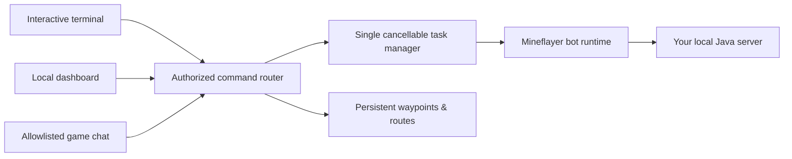

<p align="center">
  
</p>

<h1 align="center">BroBot</h1>

<p align="center">
  <strong>A local-first Minecraft Java automation bot with 51 commands, a live dashboard, and safety built into every physical task.</strong>
</p>

<p align="center">
  
  
  
  <a href="https://github.com/flowzygames/BroBot/actions/workflows/ci.yml"></a>
  
</p>

<p align="center">
  <a href="#quick-start">Quick start</a> ·
  <a href="docs/COMMANDS.md">51 commands</a> ·
  <a href="docs/ARCHITECTURE.md">Architecture</a> ·
  <a href="docs/TROUBLESHOOTING.md">Troubleshooting</a>
</p>

BroBot connects as a normal player to a Minecraft: Java Edition server you control. The same bounded command language works from the terminal, the local web dashboard, or allowlisted in-game chat—without an LLM, hosted database, telemetry service, or cloud control plane.

## One bot, a whole toolbox

| Capability | What BroBot can do |
|---|---|
| 🧭 **Explore** | Navigate coordinates, follow players, save waypoints, run patrol routes, wander, and recover a death location. |
| ⛏️ **Gather** | Mine blocks and veins, chop wood, collect drops, craft, smelt, and fish with bounded counts and distances. |
| 🌾 **Create** | Scan and tend farms, replant crops, place blocks, and build inventory-backed floors, walls, and boxes. |
| 🛡️ **Survive** | Eat safely, equip scored armor, sleep, fight mobs, guard an area, hunt, flee, and opt into local-only PvP. |
| 🎛️ **Control** | Use an interactive terminal, polished loopback dashboard, or rate-limited allowlisted Minecraft chat. |
| 🔒 **Stay safe** | Cancel active work, protect valuable blocks, prevent hazardous digging, cap every task, and reconnect cleanly. |

Once dependencies and a compatible server are installed, `minecraft.auth: "offline"` plus loopback addresses lets BroBot run without cloud calls. Microsoft authentication and a fresh dependency/server installation still require internet access.

> [!IMPORTANT]
> Use BroBot only on a server you own or where automation is permitted. A bot can lose items, die, alter the wrong block, or partially finish a task. Back up important worlds and begin in a disposable test world.

## Compatibility

- **Minecraft: Java Edition only.** Bedrock Edition and Bedrock protocol bridges are not supported.
- **Node.js 22 or newer.** This is the bot runtime.
- **A Java runtime appropriate for your server.** This is separate from Node.js. Paper 1.20–1.21.11 uses Java 21 according to Paper's compatibility table; newer server releases may require newer Java.
- **Minecraft versions through 1.21.11.** The pinned Mineflayer 4.37.1 advertises Java Edition 1.8.8 through 1.21.11. BroBot does not claim support for Minecraft 26.1 or later until its pinned protocol stack does.
- **Vanilla or Paper server.** No server plugin is required. Server-side claims, anti-cheat, chat transformation, or permissions can intentionally block features.

Version negotiation defaults to `auto`. Older supported Minecraft versions do not contain every modern block, item, crop, or mechanic named in this guide; commands validate against the registry actually negotiated with the server.

Primary references: [Mineflayer 4.37.1](https://github.com/PrismarineJS/mineflayer/tree/4.37.1), [official Vanilla Java server download](https://www.minecraft.net/en-us/download/server), [Paper downloads](https://papermc.io/downloads/paper/), and [Paper setup/Java requirements](https://docs.papermc.io/paper/getting-started/).

## What is included

```text
config.example.json                 documented configuration template
local-server/server.properties.example
                                     loopback-only offline-mode server example
src/                                 TypeScript application and services
public/                              dependency-free local dashboard UI
test/                                parser/config/router/dashboard/storage/task tests
docs/COMMANDS.md                     complete command syntax and behavior
docs/ARCHITECTURE.md                 internals, trust model, and plugin caveats
docs/TROUBLESHOOTING.md              symptom-oriented diagnostics
```

Minecraft/Paper server jars, worlds, `eula.txt`, credentials, and account tokens are intentionally not included.

## How it fits together



Every physical command enters one managed task lane. Starting conflicting work is rejected unless the operator deliberately uses `--replace`; `stop`, death, disconnect, timeout, and shutdown all converge on the same cleanup path.

## Quick start

### 1. Install the bot dependencies

From this project directory:

```sh
node --version
npm ci
```

Node must report v22 or newer. `npm ci` uses the lockfile and requires internet on a fresh machine. Once installed, do not delete `node_modules` if you plan to run without internet.

### 2. Create your config

```sh
cp config.example.json config.json
```

PowerShell equivalent: `Copy-Item config.example.json config.json`.

At minimum, edit these values:

```json
{
  "minecraft": {
    "host": "127.0.0.1",
    "port": 25565,
    "username": "BroBot",
    "auth": "offline",
    "version": "auto"
  },
  "commands": {
    "prefix": "!",
    "allowlist": ["YourExactMinecraftName"],
    "publicCommands": ["help", "status"]
  }
}
```

Keep the rest of `config.example.json`; partial JSON is merged over safe defaults, but retaining the fields makes the active policy visible. Use a distinct bot username that no human client uses.

`minecraft.host` and `minecraft.port` must name the server's actual TCP endpoint. BroBot's cancellable direct connector deliberately skips Minecraft DNS SRV discovery, so an SRV-only address is not enough; use the SRV record's real target and port instead.

### 3. Set up a compatible local Java server

Choose either Vanilla or Paper. This repository does not download or redistribute their jars.

1. Pick a **Minecraft: Java Edition server version no newer than 1.21.11**. The current “latest” download may be newer than the pinned bot stack; check the version before using it. Paper's build explorer can provide supported older builds. Download only from the [official Minecraft server page](https://www.minecraft.net/en-us/download/server) or [Paper's official downloads](https://papermc.io/downloads/paper/).
2. Put the legitimately downloaded jar in `local-server/` and call it `server.jar`, or adjust the commands below to its real filename.
3. Check the server Java runtime, then run the jar once so it generates its own files:

   ```sh
   cd local-server
   java -version
   java -Xms1G -Xmx2G -jar server.jar nogui
   ```

4. The first run should stop and create `eula.txt`. Read the [Minecraft EULA](https://www.minecraft.net/eula). **Only if you personally agree**, edit the generated file from `eula=false` to `eula=true`. BroBot does not create or preaccept it.
5. Copy the supplied server example over the generated properties (back up any values you want to retain):

   ```sh
   cp server.properties server.properties.generated
   cp server.properties.example server.properties
   ```

   In PowerShell, use `Copy-Item server.properties server.properties.generated` and `Copy-Item server.properties.example server.properties`.

6. Start the server again and wait for `Done`:

   ```sh
   java -Xms1G -Xmx2G -jar server.jar nogui
   ```

7. In the Minecraft server console, add the exact bot name and your exact Java client name to the whitelist:

   ```text
   whitelist add BroBot
   whitelist add YourExactMinecraftName
   whitelist list
   ```

The example binds `server-ip=127.0.0.1`, uses port 25565, and sets `online-mode=false` for a same-computer sandbox. Your Java client can join `127.0.0.1:25565`.

> **Offline-mode security:** the server does not verify username ownership. Anyone who can reach it can impersonate `BroBot` or an allowlisted operator. Do not port-forward it, bind it to a public interface, or rely on the Minecraft/bot username allowlists as authentication. For remote players, prefer `online-mode=true` plus legitimate Microsoft-authenticated accounts and reassess the config.

Paper is optional. If you choose Paper, follow [its getting-started guide](https://docs.papermc.io/paper/getting-started/) and use the same EULA/config procedure. A first Paper launch can require internet to prepare its runtime. Do not add plugins until the base setup works; a plugin can change pathing, chat, recipes, windows, protections, or combat behavior.

### 4. Start BroBot

From the project directory in a second terminal:

```sh
npm run dev -- --config ./config.json
```

For compiled operation:

```sh
npm run build
npm start -- --config ./config.json
```

If `config.json` exists in the current directory, `--config` is optional. The process prints connection events and, by default, a dashboard URL at [http://127.0.0.1:8765](http://127.0.0.1:8765).

The full CLI is:

```text
npm run dev -- [--config config.json] [--no-dashboard]
npm run dev:watch -- [--config config.json] [--no-dashboard]
npm run build
npm start -- [--config config.json] [--no-dashboard]

-c, --config <path>   read a JSON config file
    --no-dashboard    disable the dashboard for this run
-h, --help            show CLI help
-v, --version         show BroBot version
```

Use `npm run dev` for normal interactive source execution: terminal commands go directly to the bot. `npm run dev:watch` is only a code-development convenience; its watch supervisor may intercept terminal input and restarts the bot whenever watched source changes.

### 5. Try read-only commands first

At the `brobot>` terminal prompt, omit the chat prefix:

```text
status
safety
environment
inventory
nearby all --radius 16
help
```

In Minecraft chat, include the configured prefix:

```text
!status
!come
```

The terminal/dashboard also tolerate one leading configured prefix, but omitting it keeps the surfaces distinct. See [the complete command reference](docs/COMMANDS.md) before using mining, building, container, dropping, or combat commands.

## Control surfaces

### Terminal

The terminal is the simplest trusted control surface. It queues lines in order, prints command replies, and keeps running across a manual `disconnect`. Useful lifecycle commands:

```text
disconnect
connect
reconnect
shutdown
```

`Ctrl+C` also performs graceful shutdown.

### Dashboard

The dashboard shows connection/vitals, position, players, inventory, active task, logs, and a command box. It serves only local static HTML/CSS/JavaScript and polls the local API.

- Default bind: `127.0.0.1:8765`
- With an empty `dashboard.authToken`, the dashboard API accepts loopback requests only.
- A non-loopback dashboard bind is refused unless a token of at least 32 characters is configured; failed authentication is rate-limited per remote address.
- Static assets remain readable so the browser can display the token prompt; every `/api/*` request uses the token when configured.

Example API call:

```sh
curl \
  -H "Content-Type: application/json" \
  -H "Authorization: Bearer YOUR_TOKEN" \
  -d '{"command":"status"}' \
  http://127.0.0.1:8765/api/command
```

Omit the `Authorization` header only when the configured token is empty and the request uses loopback. Do not treat a bearer token over plain HTTP as safe for an untrusted network.

### In-game chat and whispers

Messages beginning with `commands.prefix` are parsed as commands. Replies to whispers use `/tell` only when the sender is a standard 1–16 character Java username; a malformed/plugin-supplied sender is never interpolated into a server command and the reply falls back to ordinary public chat. Replies to ordinary chat are public. Long replies are split into chat-sized parts. Do not send secrets through in-game commands.

`publicCommands` may be used by anyone. Other commands require an allowlisted username unless they are local-only, in which case chat can never call them. The defaults expose only `help` and `status` publicly. On an offline-mode server, this is convenience filtering rather than verified identity.

In-game commands are serialized, limited to eight queued requests globally, and rate-limited to one accepted command per username every two seconds to protect the bot's chat connection from reply floods.

## Safety and cancellation

The design has layered bounds, but no automation is risk-free:

- One managed physical task runs at a time.
- `stop`/`cancel` aborts current work and clears pathfinder, digging, held-use, open-window, and control state.
- `--replace` cancels old work before an eligible new action begins.
- Every task is cancelled after `safety.maxTaskSeconds`.
- Mining/gathering, building, search, and PvP have independent configuration gates and limits.
- General travel does not dig, parkour, scaffold, or build one-block towers. Resource workers break only their explicit target coordinate when permitted.
- Lava is avoided; water can be optionally avoided.
- Protected block names are never intentionally mined and occupied build targets are skipped rather than cleared.
- Mining and farm harvesting use a direct bounded path/tool/dig/drop-pickup worker and require at least one empty inventory slot before each break.
- Routine physical resource/inventory work, farming, and building stop at 6 health or below; manual eating remains available as a recovery action, and combat also aborts pursuit and attacks at that threshold.
- PvP is disabled by default and its command is always local-only.

Run `safety` to inspect the effective policy. `stop` is cooperative and cannot undo a packet already acted on by the server. If an immediate hard stop matters, disconnect the bot or stop the local server, then inspect the world/inventory before resuming.

## Configuration reference

`config.example.json` is the canonical editable template. Objects are deep-merged with built-in defaults; arrays are replaced as a whole.

### `minecraft`

| Key | Meaning |
|---|---|
| `host`, `port` | Actual server TCP endpoint. Defaults to `127.0.0.1:25565`; SRV-only domains are not resolved. |
| `username` | Bot's Java username. In offline mode this is an unverified claimed identity. |
| `auth` | `offline` for the isolated local server; `microsoft` for Microsoft authentication. Microsoft mode is not runtime-offline. |
| `version` | `auto` asks Mineflayer to negotiate; otherwise use an exact supported string. Pre-spawn network attempts are stopped after 30 seconds. |
| `reconnect.enabled` | Retry unexpected connection ends. |
| `reconnect.initialDelayMs`, `maxDelayMs` | Exponential-backoff bounds. |
| `reconnect.maxAttempts` | `0` means unlimited. |

### `commands`

| Key | Meaning |
|---|---|
| `prefix` | Exactly one character, used for in-game commands. |
| `allowlist` | Usernames allowed to issue non-public, non-local commands in chat. Not authentication in offline mode. |
| `publicCommands` | Primary command names any chat user may call. Keep this small and read-only. |
| `announceErrorsInChat` | When false, command errors are logged but not echoed into Minecraft chat; successful replies are unchanged. |

### `dashboard`

| Key | Meaning |
|---|---|
| `enabled` | Starts the local HTTP dashboard unless CLI `--no-dashboard` is also present. |
| `host`, `port` | Keep `127.0.0.1:8765` for the normal local trust model. |
| `authToken` | Bearer token for every API request. It may not have edge whitespace/control characters and must be at least 32 characters for a non-loopback bind. Prefer `DASHBOARD_TOKEN` to avoid saving it in JSON. |

### `safety`

| Key | Meaning |
|---|---|
| `allowDigging` | Gates mining and crop harvesting. |
| `allowBuilding` | Gates all placement/build plans. |
| `allowPvp` | Additional gate for player targeting; default false. |
| `maxTaskSeconds` | Wall-clock timeout for managed work. |
| `maxGatherCount` | Per-command cap for gathered, transferred, crafted, smelted, farmed, dropped, or fished counts; whole recipe batches must also fit below it. |
| `maxBuildBlocks` | Maximum requested placements in one build plan. |
| `maxSearchDistance` | Upper bound for searches and builder target distance. |
| `protectedBlocks` | Registry names pathing/resource/building layers must treat as protected. Defaults cover containers/furnaces, spawners, explosive/portal/fire hazards, and command/structure control blocks; `furnace`/`lit_furnace` and `spawner`/`mob_spawner` are treated as legacy-equivalent aliases. Add valuables specific to your world/plugins. |

### `behavior`, `storage`, and `logging`

| Key | Meaning |
|---|---|
| `behavior.followDistance` | Default follow/come distance. |
| `behavior.guardRadius` | Default guard leash/scan radius. |
| `behavior.farmRadius` | Default crop scan/tend radius. |
| `behavior.patrolPauseMs` | Pause at patrol points. |
| `behavior.autoEat`, `autoArmor` | Enable the corresponding spawn-time survival helpers. Background auto-eat is hunger-only and starts below 15 food points. |
| `behavior.avoidWater` | Adds water to pathfinder's avoidance set. |
| `storage.dataDirectory` | Directory for `state.json`; relative paths resolve beside the selected config file, otherwise from the working directory. |
| `logging.level` | Minimum terminal log level: `debug`, `info`, `warn`, or `error`. |
| `logging.maxEntries` | Bounded in-memory entries retained for dashboard polling. |

Supported environment overrides:

```text
MC_HOST
MC_PORT
MC_USERNAME
MC_AUTH
DASHBOARD_TOKEN
```

Environment values win over JSON. Configuration is loaded once; restart to apply changes.

## Persistent data and backups

Waypoints, routes, and last-death position are stored in `.brobot-data/state.json` by default. Writes are serialized through a temporary file and atomic rename. Back up both the Minecraft world and bot data before experiments.

If upgrading from an earlier build that used `.bot-data`, move that directory to `.brobot-data` once before starting BroBot.

Do not run multiple BroBot processes against the same state directory or edit `state.json` while the process is running. Dashboard logs are only in memory and are not a persistent audit log.

## Verification and development

```sh
npm run typecheck
npm test
npm run check
npm run build
```

`npm run check` runs the typecheck and test suite. The code is ESM TypeScript and compiled output goes to `dist/`.

### Dependency audit status

At this release, `npm audit --omit=dev` reports **8 moderate transitive findings and no high or critical findings**. They are rooted in `uuid` through `prismarine-auth`/`minecraft-protocol`, plus Mineflayer-ecosystem packages that inherit the same finding. npm currently reports no non-breaking/current fix for the tree.

Do not run `npm audit fix --force`: it can replace pinned protocol/plugin versions with incompatible releases without resolving the upstream issue. Track the Mineflayer/Prismarine upstream packages, retest before upgrades, and keep both the game server and dashboard loopback-only to reduce exposure.

## Operational caveats

- Loaded-world view is not a global map. `locate`, entity sensing, resources, crops, containers, and pathfinding only know chunks/entities the server sends.
- Pathfinding can fail on changing terrain, doors/fences, hazards, fluids, unusual block collision, entities, unloaded chunks, anti-cheat, or server lag.
- Actions are not transactions. Cancellation or failure can leave partial builds, harvested blocks, tossed items, or furnace/container contents.
- `protectedBlocks` is an exact name guard, not ownership detection. Expand it for your world.
- Server spawn protection, game mode, claims, plugins, or permissions may veto a valid-looking action.
- The bot does not recursively craft prerequisites, traverse portals for waypoints, recover expired death drops, or resume tasks after death/reconnect.
- Auto-armor and auto-eat are helpers, not guarantees of survival.
- Combat uses core Mineflayer/pathfinder with bounded chase, low-health abort, progress watchdog, and leashes; it is not sophisticated tactical AI.
- Feature behavior varies by Minecraft registry/version. Pin a known-good server version and back up before updating.

## More documentation

- [Complete commands, flags, ranges, aliases, and permissions](docs/COMMANDS.md)
- [Architecture, plugins, task lifecycle, trust model, and extension guide](docs/ARCHITECTURE.md)
- [Troubleshooting installation, servers, commands, pathing, work, dashboard, and state](docs/TROUBLESHOOTING.md)
- [Loopback-only local server properties example](local-server/server.properties.example)

This project does not bypass authentication, anti-cheat, claims, bans, or server rules. If a server control blocks the bot, fix the permission/design with the operator rather than attempting to evade it.
